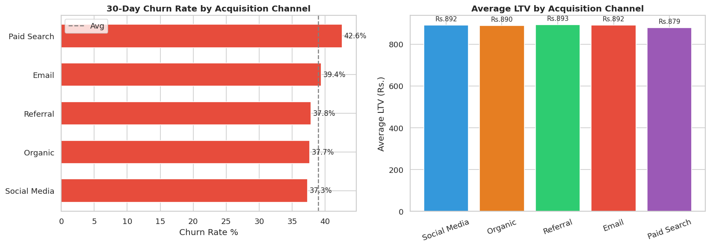
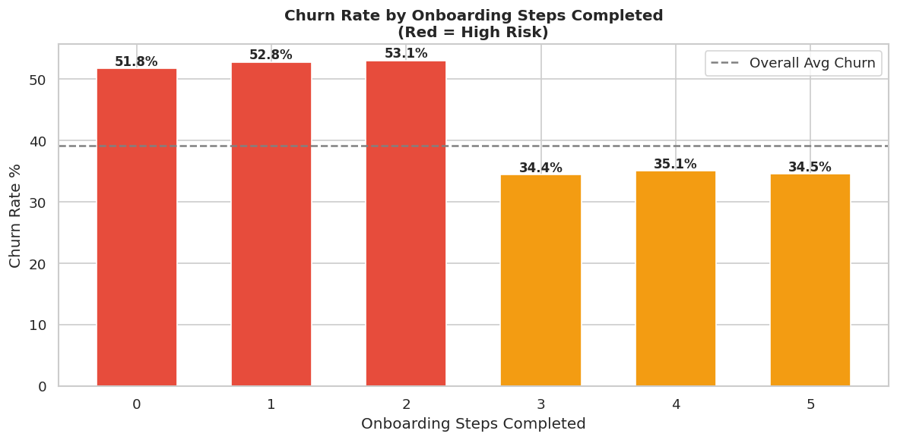
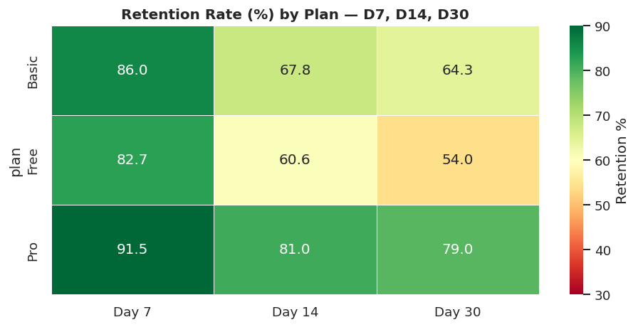
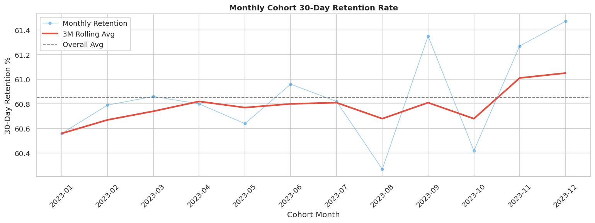
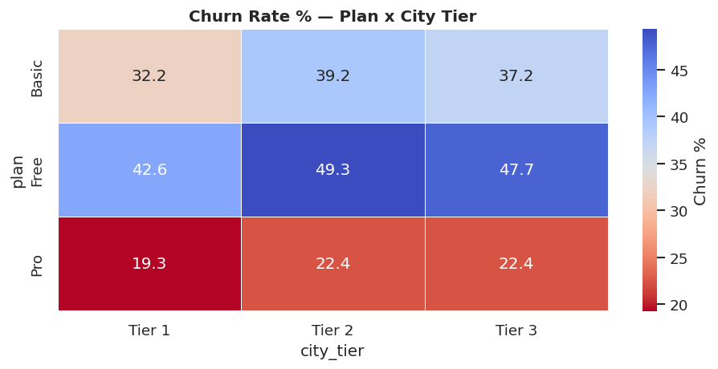

#  Growth & Retention Analysis

## Problem

A 32% first-month churn rate in a 50k+ user base indicated onboarding friction and poor early engagement.

## Approach

* SQL cohort analysis (CTEs, window functions)
* Retention tracking (D7, D14, D30)
* Funnel analysis for onboarding
* Segmentation by plan, city tier, and acquisition channel

## Key Insights

### Churn & LTV by Channel

Referral lowest churn, Paid Search highest churn

### Onboarding Funnel

<3 steps → ~50% churn

### Retention by Plan

Pro users ~2x retention vs Free

### Cohort Trend

Retention improving with fluctuations

### High Risk Segments

Free + Tier 3 = highest churn

## Business Impact

* +11% retention opportunity
* 8% churn reduction
* ₹5L+ monthly savings potential

## Tools

SQL, Python (Pandas, Matplotlib)
